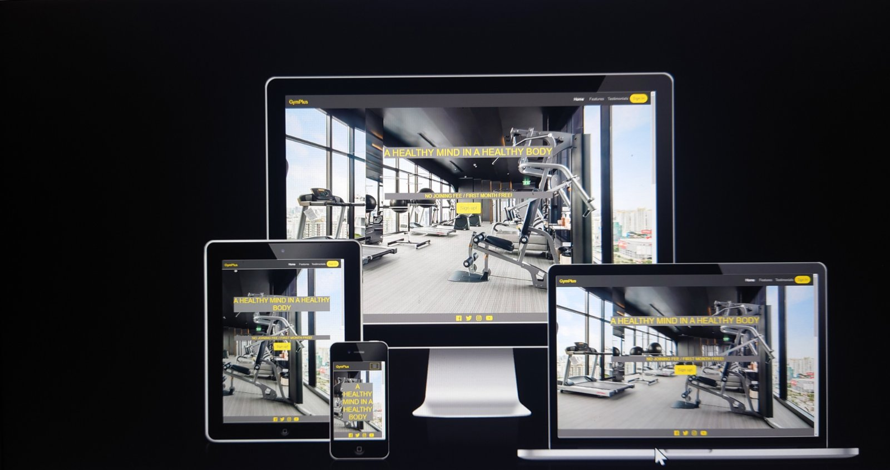
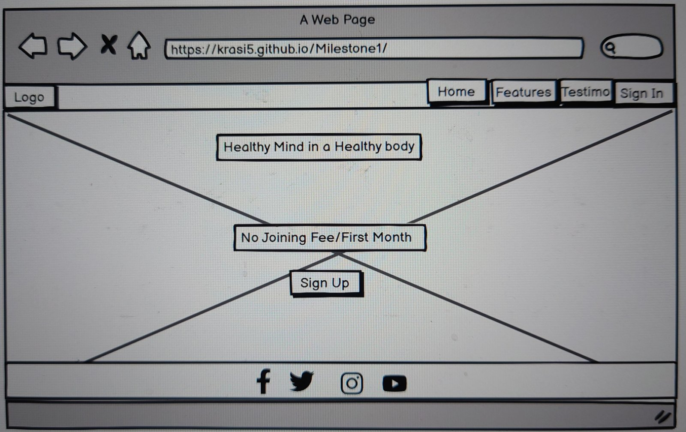
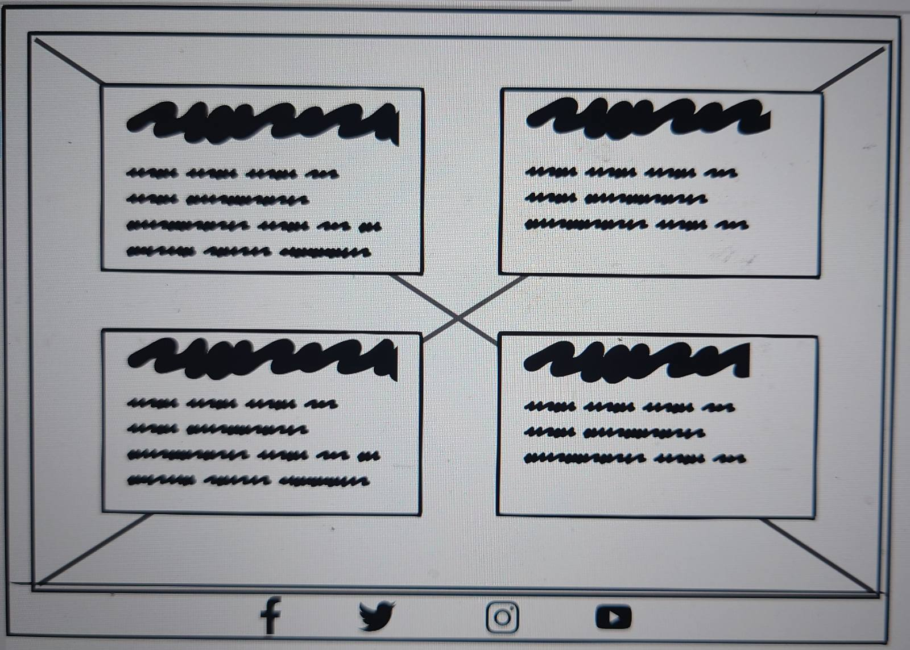
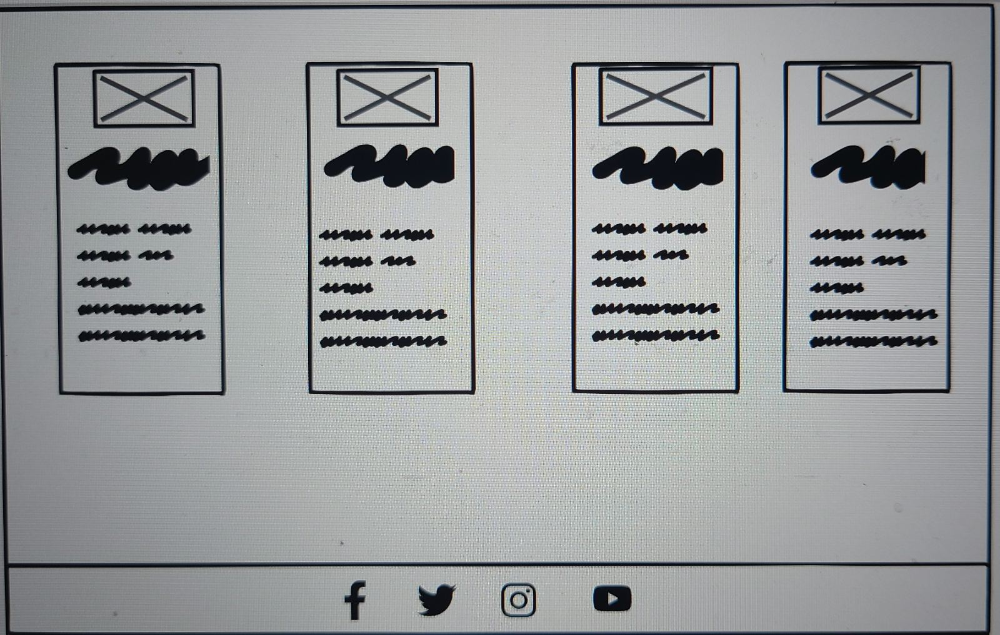
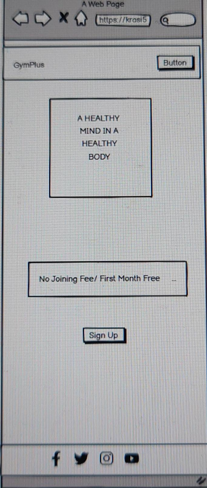
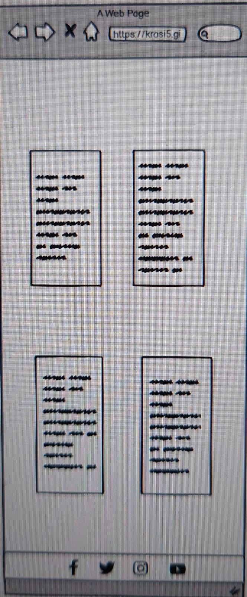
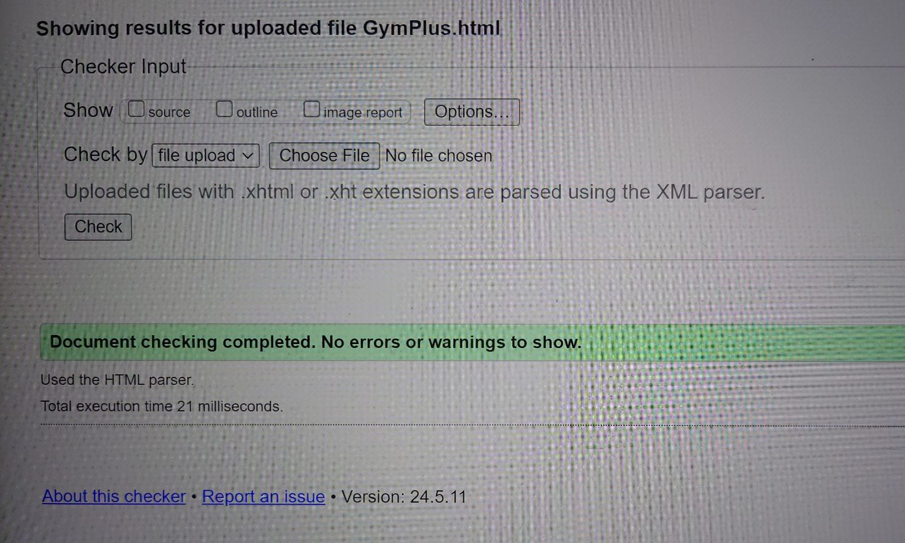
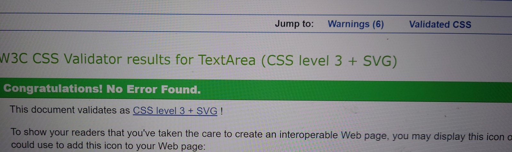

README.md
<h1 align="center">GymPlus</h1>

[View the live project here.](http://127.0.0.1:3000/GymPlus.html)

GymPlus is a fitness-oriented website, created as a Milestone Project 1 for a Web Development course. It is designed to be responsive and accessible on a range of devices, making it easy to navigate for potential users.

<h2 text-align="center"></h2>

## User Experience (UX)

   ### User stories
       
  -   #### First Time Visitors Goals

      1. As a First Time Visitor, I want to easily understand the main purpose of the site and learn more about the company.
      2. As a First Time Visitor, I want to be able to easily navigate through the site and find information about the service they provide.
      3. As a First Time Visitor, I want to look for testimonials to understand what the service users think about the company. 

 -   #### Returning Visitors Goals
    
      1. As a Returning Visitor, I want to find information about services offered.
      2.As a Returning Visitor, I want to navigate quickly through the site and familiarise myself with the options offered.
      3. As a Returning Visitor, I want to locate their social media links to find information on social media about the company's followers to determine how known and trusted they are.

 -   #### Frequent User Goals
     
      1. As a Frequent User, I want to be able to access the site from different devices and find easily the information I need, to choose a service.
      2. As a Frequent User, I want to be able to book a service quickly and easily.
      3. As a Frequent User, I want my details to be stored safetly.

 ### Design

 -  #### Colour Scheme
   -   The website main colors are gray and gold.
 -  #### Typography
   -   The Noto Serif from [Google Fonts](https://fonts.google.com/) is the main font used throughout the whole website with Sans Serif as the fallback font in case for any reason the font isn't being imported into the site correctly. Noto is a global font collection for writing in all modern and ancient languages. The font is attractive and appropriate. 
 -  #### Imagery
   - A large, background hero image is designed to convey the main purpose of the website and catch the potential user's attention.

- ### Wireframes

   -  Home Page Wireframe - 
   

   

   -  Mobile Wireframe - 

## Features

  - Responsive on all devices
  - Link to social media accounts
  - A sign up form for new users
  - A sign in form for frequent users

 Purpose of the GymPlus website

GymPlus is a fitness-oriented website, created as a Milestone Project 1 for a Web Development course.
The aim is to provide a range of physical exercises, in a friendly environment with support of individual's abilities. Proper nutrition is a part of physical and mental well-being as well as the opportunity to accommodate the needs of the young family members, while the people exercising.

    Navigation Bar 
   
It consists of a logo sign and three pages - Home, Features, and Testimonials plus the Sign In button, which gives a connection to the required information. It is responsive to different viewports and  accommodates the minimal space. The bar changes to a hamburger icon in small devices and collapses to allow access. I wanted and tried to change it to gold color, however I did not manage to overcome the anchor tag to do it.

Landing page

It consists of a picture with the motto, which conveys the purpose of the site. 
There is an dicount advertise, encouraging the visitors to have a trial. The Sign Up button open a box for personal details needed .
  

Features page 

It represents the services provided, divided into four sections. A picture was used to provide the corresponding color and make the page more interesting. 

Testimonials 

The page presents the opinions of four people. The text was wrapped in rectangles in an order different than the previous page which was a problem in a smaller size as the height was set at 60vh.

Responsivness
The site was created to be responsive on various devices: mobile phone, tablet, desktop

## Technologies Used

### Languages Used 

-   [HTML5](https://en.wikipedia.org/wiki/HTML5)
-   [CSS3](https://en.wikipedia.org/wiki/CSS)

### Frameworks, Libraries & Programs Used

1. [Bootstrap 4.1.3:](https://getbootstrap.com/docs/4.1/getting-started/introduction/)
 - Bootstrap was used to assist with the styling and responsiviness of the website.
 2. [Google Fonts](https://fonts.google.com/)
 - Google fonts were used to import the 'Noto Serif' font into the GYmPlus.html file which was used on all pages throught the project.
 3. [Font Awesome](https://fontawesome.com/)
 - Font Awesome was used to add icons of social media for aesthetic and UX purposes.
 4. [Gitpod](https://gitpod.io/) 
  Gitpod terminal was used to commit and push to GitHub.
 5. [W3schools](https://www.w3schools.com/) 
 W3schools was used to assist with styling of the website.
 6. [Balsamiq:](https://balsamiq.com/)
 Balsamiq was used to create the [wireframes](https://github.com/)

## Testing

The W3C Markup Validator and W3C CSS Validator Services were used to validate all the pages in the project to ensure no syntax errors exist.

- [W3C Markup Validator]
-  [W3C CSS Validator]

### Testing User Stories from User Experience (UX) Section

1. As a First Time Visitor, I want to easily understand the main purpose of the site and learn more about the company.
    1. Upon entering the site, users are automatically greeted with a clean and easily readable navigation bar to go to the page of their choice.  Underneath there is a Hero Image with the moto and advertisng discount text, and sign up button.
    2. The main points are made immediately with the moto text and hero image.
    3. The user has option to scroll down or click social media's buttons.
      
      
2. As a First Time Visitor, I want to be able to easily navigate through the site and find information about the service they provide.
     
     The user has option to scroll down or click social media's buttons.
     
 3. As a First Time Visitor, I want to look for testimonials to understand what the service users think about the company. 

 The user has option to scroll down 

1. As a Returning Visitor, I want to find information about services offered.

2.As a Returning Visitor, I want to navigate quickly through the site and familiarise myself with the options offered.

 3. As a Returning Visitor, I want to locate their social media links to find information on social media about the company's followers to determine how known and trusted they are.

 - A click on the social media links opens a new window with the corresponding icon's social media page.

 1. As a Frequent User, I want to be able to access the site from different devices and find easily the information I need, to choose a service.

 - The webste is designed to be responsive on all devices.
 
 2. As a Frequent User, I want to be able to book a service quickly and easily.
 - A sign in button on the navigation bar provides quick access to the customer's account
      
 3. As a Frequent User, I want my details to be stored safetly.

### Further Testing

-  The website was tested on Google Chrome and Microsoft Edge browsers.
-   The website was viewed on a variety of devices such as Desktop, Laptop, mobile phones and tablets.

### Known Bugs

On some tablets and mobile phones there was a white gap between the navigation bar and the hero image. The issue was fixed with a snippet:[perfect-full-page-background-image/](https://css-tricks.com/)

## Credits

### Code

 The images came from [pixabay website](https://pixabay.com/) ans [pexels website](https://www.pexels.com/)

 A code snippet was used from [StackOverflow post](https://stackoverflow.com)

 [Bootstrap 4.1.3:](https://getbootstrap.com/docs/4.1/getting-started/introduction/)

[Code Institute](https://learn.codeinstitute.net/ci_program/level5diplomainwebappdevelopment) learning videos and SamleREADME were used as a guidance.

README example recommended by my mentor [github](https://github.com/Chikayo-k/pp1-hotspring-ck/blob/main/README.md)

### Acknowledgements

 -  My Mentor for continuous helpful feedback.

 -  My Tutor at Ashford College for her empowering support.

